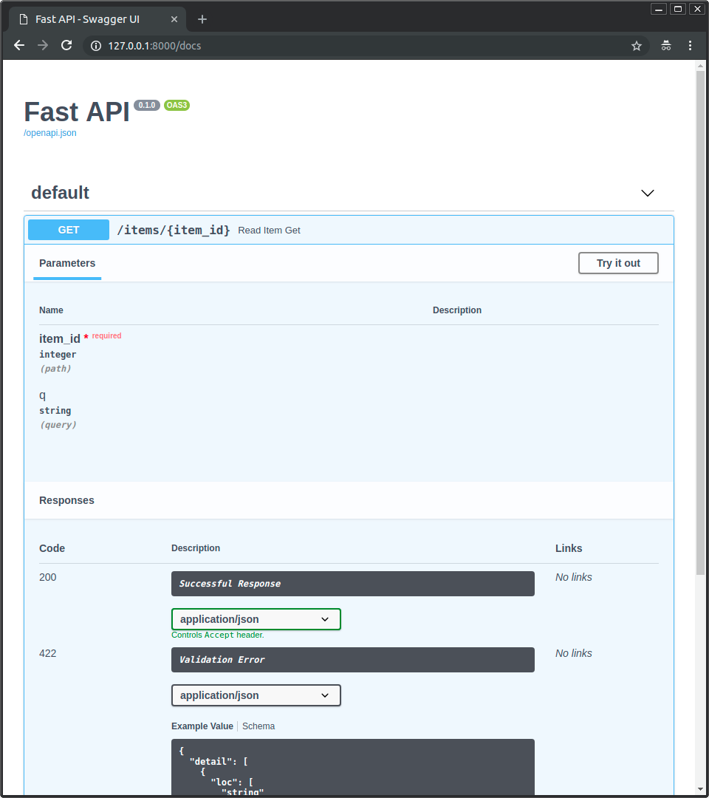

# Example Python with FastAPI, MySQL, Redis
Follow links shows information about the requirements used for this microservice:
* [Poetry](https://python-poetry.org/docs/#installation)
* [FastAPI](https://fastapi.tiangolo.com/tutorial/)
* [SQL Database](https://fastapi.tiangolo.com/tutorial/sql-databases)
* [Redis Database](https://pypi.org/project/redis/)
* [Configuration from environment variables and from file](https://pypi.org/project/python-decouple/)

## Folders
```shell
└─╾ tree -L 2 .
.
├── README.md
├── __pycache__
├── doc
├── docker
│   ├── Dockerfile
│   └── docker-compose.yml
├── poetry.lock
├── pyproject.toml
├── python_fastapi_poetry.iml
├── src
│   ├── __init__.py
│   ├── __pycache__
│   ├── main.py
│   ├── redis_db
│   └── sql_db
└── test_main.http
```

## Python Build and Run
We use [Poetry](https://python-poetry.org/docs/#installation) for the following actions.

* Create virtualenv configuration and install current dependencies
```shell
poetry install
```

* Install new dependencies
```shell
poetry add [dependencies]
```

* Run app
```shell
python -m uvicorn app.src.main:app --reload 
```


## Docker Details
### Build Docker Image
```shell
docker build . -f docker/Dockerfile
```

### Docker Compose with all dependencies 
```shell
docker-compose -f docker/docker-compose.yml up
```

## API Documents
* http://0.0.0.0:8000/docs



## Helm

```shell
helm dep up helm/py_fastapi_poetry
```

```shell
helm upgrade py helm/py_fastapi_poetry/ -i --debug
```

```shell
helm uninstall py
```
